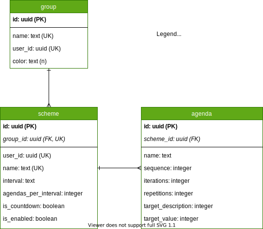

# Scheme Agenda API
APIs for defining a user's scheme details on an interval.

## Authentication
Authentication will be handled by a separate Auth API with its own data store. A token will be required for all requests on behalf of a User ID (stored within the token).

## Database Structure

### Group
Groups a user's schemes (ex. Workout, Diet, Bills, etc.)
* Name: name of the group
* User ID: the user that created this group
* Color: a color to categorize the group (optional)

### Scheme
A goal to be accomplished (ex. drink 8 glasses of water a day, do a workout routine 3 times a week, pay bills once a month, etc.)
* Group ID: the group of the scheme
* User ID: the user that created this scheme
* Name: name of the scheme
* Interval: interval of time (day, week, month, year)
* Agendas Per Interval: how many agendas need to be completed to satisfy the goal
* Is CountDown: whether routines will count up or down

### Agenda
What needs to be done to satisfy one instance of a scheme (ex. drink glass of water, do deadlifts and bench press and squats 3 sets of 8 reps, etc.)
* Scheme ID: the scheme of the agenda
* Name: name of the agenda
* Sequence: order in which this needs to be completed
* Iterations: how many times this agenda needs to be completed
* Repetitions: how many times repetitions it takes to complete an iteration
* Target Value: a number that should be targeted to complete  (8 ounces, 225 pounds, etc.) 
* Target Description: descriptor for the value (ounces, pounds) 
